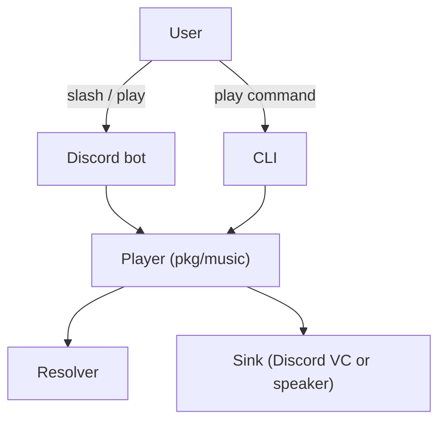

[](https://pkg.go.dev/github.com/keshon/melodix) [](https://goreportcard.com/report/github.com/keshon/melodix) [](https://github.com/keshon/melodix/releases) [](LICENSE)

# Melodix — Self-hosted Discord music bot & CLI player

> Presented by Señor Mega.
> Powered by Go, FFmpeg, and several questionable engineering decisions.

Self-hosted music player written in Go that can run either as:

- a **Discord music bot** for voice channels
- a **CLI player** that plays music directly from your terminal

Melodix supports **YouTube, SoundCloud and internet radio**, using multiple parsers with automatic fallback for resilience.

---

## Table of contents

* [Features](#features)
* [Try Melodix without installing](#try-melodix-without-installing)
* [Commands](#commands)
* [How-to's](#how-tos)
* [Running Melodix yourself](#running-melodix-yourself)
* [How it works](#how-it-works)
* [Music package overview](#music-package-overview)
* [Why Melodix?](#why-melodix)
* [Support](#support)
* [FAQ](#faq)
* [Contributing](#contributing)
* [License](#license)

---

## Features

* **Discord bot** — Slash commands, voice channel playback, one bot for many servers.
* **Voice support** — Compatible with Discord's current voice protocol (DAVE).
* **CLI player** — Same engine as the bot: play, next, stop, queue, status. No Discord token required.
* **Sources** — YouTube (link or search query), SoundCloud, internet radio (direct stream URLs). Input is auto-detected.
* **Parsers and resilience** — Multiple parsers per track ([yt-dlp](https://github.com/yt-dlp/yt-dlp), [kkdai](https://github.com/kkdai/youtube), [ffmpeg](https://github.com/FFmpeg/FFmpeg)); automatic fallback if one fails.
* **Recovery streams** — Stream retries on early termination (e.g. network hiccups).
* **Queue system** — One queue per guild (Discord) or per process (CLI).
* **Playback controls** — Play, skip, stop, clear, queue status.

**Limitations**

* YouTube live streams are not supported.
* Region-locked videos may fail.
* Some radio stream formats are unsupported.
* Stream recovery may cause short pauses.

---

## Try Melodix without installing

### Use the official server

Try the bot in [Ctrl+Z](https://discord.gg/uDnTenPxAY) Discord server: 
enter a voice channel and use slash commands in `#music-spam`.

---

### Download a release

Download pre-built binaries:

https://github.com/keshon/melodix/releases

Each archive contains:

* `melodix-discord` — Discord bot
* `melodix-cli` — terminal player

---

## Commands


<!-- generated -->

### 🕯️ Information

- **/about** — Discover the origin of this bot
- **/help** — Get a list of available commands
  - **/help category** — View commands grouped by category
  - **/help group** — View commands grouped by group
  - **/help flat** — View all commands as a flat list

### 🎵 Music

- **/music** — Control music playback
  - **/music play** — Play a music track
  - **/music next** — Skip to the next track
  - **/music stop** — Stop playback and clear queue

### ⚙️ Settings

- **/commands** — Manage or inspect commands
  - **/commands log** — Review recent commands called by users
  - **/commands status** — Check which command groups are enabled or disabled
  - **/commands toggle** — Enable or disable a group of commands
  - **/commands update** — Re-register or update slash commands
- **/maintenance** — Bot maintenance commands
  - **/maintenance ping** — Check bot latency
  - **/maintenance download-db** — Download the current server database as a JSON file
  - **/maintenance status** — Retrieve statistics about the guild


<!-- /generated -->

Example usage:

```
/music play Never Gonna Give You Up
/music play https://www.youtube.com/watch?v=dQw4w9WgXcQ
/music play http://stream-uk1.radioparadise.com/aac-320
```

You must be in a voice channel to use `/music play`.

---

## How-to's

* **How to add Melodix to your Discord server** — Use the OAuth2 invite link (see [Discord bot — Step 1](#discord-bot--step-1-create-the-bot-in-discord)); replace `YOUR_APPLICATION_ID` with your app ID, open the URL, choose your server, and authorize. Then use slash commands. To self-host the bot, see [Running Melodix yourself](#running-melodix-yourself).
* **How to play your first track** — (Discord) Join a voice channel, then run `/music play` with a link or search term (e.g., `/music play Never Gonna Give You Up`).
* **How to self-host the bot** — Install FFmpeg (and optionally yt-dlp) on your PATH, create a bot in the [Discord Developer Portal](https://discord.com/developers/applications), set `DISCORD_TOKEN` in `.env`, and run the Discord binary. Full steps: [Discord bot — Step 2](#discord-bot--step-2-configure-and-run).
* **How to run the CLI player** — Build with `go build -o melodix-cli ./cmd/cli` or use the `melodix-cli` binary from [releases](https://github.com/keshon/melodix/releases). No Discord token needed. Commands: `play`, `next`, `stop`, `queue`, `status`, `quit`. See [CLI player](#cli-player).
* **How to try without installing** — Join the [official support server](https://discord.gg/uDnTenPxAY) and use the bot in a voice channel, or download a [release](https://github.com/keshon/melodix/releases) and run the binaries. See [Try Melodix without installing](#try-melodix-without-installing).

---

## Running Melodix yourself

You can run the **Discord bot** (voice channels) or the **CLI player** (local playback). Both use the same sources and queue logic.

### What you need (both modes)

* **FFmpeg** on your system PATH. [FFmpeg download page](https://ffmpeg.org/download.html) or [repo](https://ffmpeg.org/download.html)
* **yt-dlp** (optional but recommended) on your PATH for better YouTube support. [YT-dlp repo](https://github.com/yt-dlp/yt-dlp)

For the **Discord bot** you also need a **Discord bot token** from the [Discord Developer Portal](https://discord.com/developers/applications).

### Discord bot — Step 1: Create the bot in Discord

1. Open the [Discord Developer Portal](https://discord.com/developers/applications) and create a new application. Note the **Application ID**.

2. Go to the **Bot** section and create a bot. Copy the **token** (you will use it as `DISCORD_TOKEN`).

3. Under **Privileged Gateway Intents**, enable:

   * Presence Intent
   * Server Members Intent
   * Message Content Intent

4. Invite the bot to your server using this URL (replace `YOUR_APPLICATION_ID` with your Application ID from step 1):

   `https://discord.com/oauth2/authorize?client_id=YOUR_APPLICATION_ID&scope=bot&permissions=3238912`

5. Open the URL in your browser, choose your server, and authorize. Grant the requested permissions when asked.

### Discord bot — Step 2: Configure and run

Create a `.env` file in the folder where you run the bot (or set the same variables in your environment):

```env
# Required for the Discord bot
DISCORD_TOKEN=your-discord-bot-token
```

Optional variables (you can add these to `.env` if needed):

| Variable                  | Description                                                | Default                 |
| ------------------------- | ---------------------------------------------------------- | ----------------------- |
| `STORAGE_PATH`            | Path for bot data (e.g. command state).                    | `./data/datastore.json` |
| `INIT_SLASH_COMMANDS`     | Set to `true` to register slash commands on every startup. | `false`                 |
| `DEVELOPER_ID`            | Your Discord user ID for developer-only commands.          | (none)                  |
| `DISCORD_GUILD_BLACKLIST` | Comma-separated guild IDs the bot will leave.              | (none)                  |

**Run the Discord bot:**

* **From source:** `go build -o melodix-discord ./cmd/discord` then run the binary. Ensure `DISCORD_TOKEN` is set (e.g., in `.env`).
* **From a release:** Use the `melodix-discord` binary from the [releases](https://github.com/keshon/melodix/releases) archive.
* **With Docker:** See [docker/README.md](docker/README.md) for Docker and Docker Compose instructions.

After the bot is running and invited to your server, use slash commands in any channel. For music, be in a voice channel and use `/music play` with a link or search term.

### CLI player

The CLI player uses the same playback engine but runs in your terminal and plays through your speakers. No Discord token or server setup required.

**Run the CLI player:**

* **From source:** `go build -o melodix-cli ./cmd/cli` then run the binary.
* **From a release:** Use the `melodix-cli` binary from the [releases](https://github.com/keshon/melodix/releases) archive.

**CLI commands** (at the `> ` prompt):

| Command                                 | Description                          |
| --------------------------------------- | ------------------------------------ |
| `play <url or query> [source] [parser]` | Add and play a track.                |
| `next`                                  | Skip to the next track.              |
| `stop`                                  | Stop playback and clear the queue.   |
| `queue`                                 | Show now playing and the queue.      |
| `status`                                | Show current track and queue length. |
| `quit`                                  | Exit.                                |

Example:

```
> play Never Gonna Give You Up
> queue
> next
> quit
```

---

## How it works

High level flow:

* **Discord app** — The bot connects to Discord, registers slash commands, and handles interactions. For music, it resolves the user's voice channel, gets or creates a **player** for the guild, and forwards play/next/stop to that player.
* **CLI app** — Uses the same **player** and **resolver**; a **speaker sink** instead of a Discord voice sink; same queue and controls.
* **Shared core** — The [pkg/music](pkg/music) library provides the player, resolver, stream opening, and sink abstraction. Both the Discord bot and the CLI are thin layers on top.



---

## Music package overview

The [pkg/music](pkg/music) package is the core of the bot. It implements the entire playback pipeline: resolving tracks, managing the queue, opening audio streams, and delivering PCM audio to different sinks (Discord voice or local playback).

The playback pipeline works as follows:

1. **Resolve** — User input (URL or search) goes to the **resolver**. Sources (YouTube, SoundCloud, radio) match the input and return **track metadata** (URL, title, list of available parsers). No streaming yet.

2. **Enqueue** — The **player** enqueues one or more tracks (metadata only). If nothing is playing, the caller typically calls **PlayNext**.

3. **PlayNext** — The player pops the next track and calls **startTrack**: opens a **RecoveryStream** (which wraps **TrackStream**) and starts a **playback goroutine** that will obtain a sink and stream PCM.

4. **Get sink** — The playback goroutine asks the **sink provider** for an **AudioSink**.  
   - **Discord**: joins a voice channel and returns a sink that encodes PCM to Opus and sends it to the voice connection.  
   - **CLI / local**: returns the speaker sink.  
   If obtaining the sink fails, playback stops and the queue does not advance.

5. **Open stream** — **RecoveryStream** opens a **TrackStream** by trying the track’s parsers in order (`ytdlp-link`, `kkdai-link`, `ffmpeg-link`). Each parser produces **PCM** (48 kHz, stereo, 16-bit). If the stream dies early, RecoveryStream can retry with the same or next parser (up to a limit).

6. **Stream to sink** — The player feeds the PCM **ReadCloser** into **AudioSink.Stream**. The sink runs until the stream ends or a stop signal is received.

7. **Next or stop** — When the stream ends, the player can auto-advance to the next track (`PlayNext`) or stop. Calling **Stop(true)** clears the queue and releases the sink.

Subpackages: [player](pkg/music/player), [resolver](pkg/music/resolver), [sink](pkg/music/sink), [sources](pkg/music/sources), [parsers](pkg/music/parsers), [stream](pkg/music/stream). See also [pkg/music/README.md](pkg/music/README.md) for using the library standalone.

---

## Why Melodix?

I needed a self-hosted music bot that could reliably run for **long DnD sessions** without interruptions. I also wanted to achieve:

* Natievly compiled application
* Resilient playback engine with fallback parsers and recovery streams
* Self-hosted solution anyone can run on their own server
* Get some knowledge about Go and Discord APIs

---

## Support

For help or questions, use the [official Melodix Discord server](https://discord.gg/uDnTenPxAY).

---

## FAQ

* **Why does `play` sometimes take a few seconds?**  
  The bot resolves the input (URL or search) and opens an audio stream using one of the parsers (`yt-dlp`, `kkdai`, `ffmpeg`). The first request for a track may take a moment; playback starts once the stream is ready.

* **Can I use only the music library without the bot?**  
  Yes. The [pkg/music](pkg/music) library is a standalone Go package. You can use the speaker sink and resolver for a CLI or custom app. See [pkg/music/README.md](pkg/music/README.md) and the example in [pkg/music/examples/cli_speaker](pkg/music/examples/cli_speaker).

* **Why is FFmpeg required?**  
  Parsers use FFmpeg to decode various audio formats (YouTube, radio streams, etc.) into PCM, which the bot can send to Discord or play locally.

* **Why can't the bot join the voice channel?**  
  The bot needs **Connect** and **Speak** permissions in that channel. Check the channel or server permissions for the bot role.

* **Why is there no audio or the track never starts?**  
  Ensure **FFmpeg** (and optionally **yt-dlp**) is available in your `PATH`. Check parser logs for stream open errors. Some region-locked or live YouTube streams may not be supported.

* **The bot does not start or cannot connect to Discord**  
  In some regions Discord may be blocked. If the server running the bot cannot reach Discord, the bot will fail to connect. Run it on a server with open access to Discord, or configure a proxy/VPN if necessary.

---

## Contributing

Contributions are welcome. Open an issue or pull request on [GitHub](https://github.com/keshon/melodix). For larger changes, discuss in the [Melodix Discord server](https://discord.gg/uDnTenPxAY) first.

---

## License

Melodix is licensed under the [MIT License](https://opensource.org/licenses/MIT).
