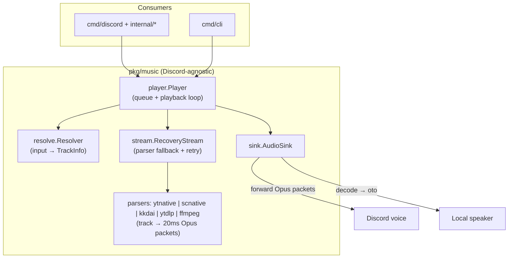
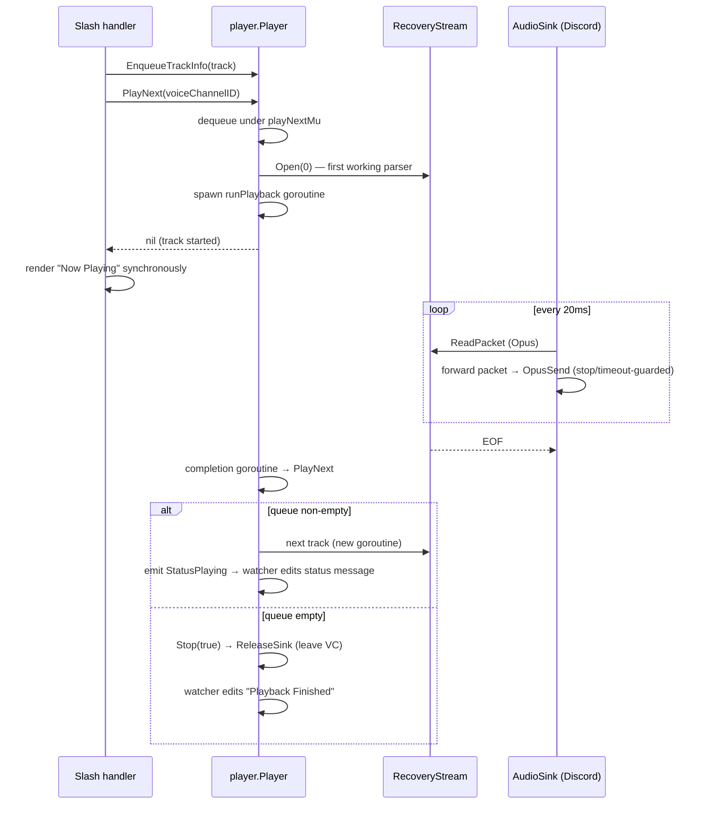

# Architecture

> House rules (naming, concurrency contracts, how to add sources/parsers) live
> in [conventions.md](conventions.md); this document covers how the system works.

Melodix is a Discord music bot built around a reusable, Discord-agnostic playback engine.
The repository ships two binaries on top of the same engine:

- **`cmd/discord`** — the Discord bot (slash commands, voice, persistence, health watchdogs).
- **`cmd/cli`** — a REPL that plays to the local speaker. It exists both as a debugging tool
  and as proof that `pkg/music` has no Discord dependency.



---

## Package map

| Path | Responsibility |
|---|---|
| `pkg/music/player` | `Player`: FIFO queue, playback goroutine, transport recovery, status channel |
| `pkg/music/resolve` | `Resolver`: input → `[]TrackInfo`; source detection and precedence |
| `pkg/music/sources` | `Source` interface + `youtube`, `soundcloud`, `radio` implementations |
| `pkg/music/parsers` | `Streamer` interface + `ytnative`, `scnative`, `kkdai`, `ytdlp`, `ffmpeg` implementations |
| `pkg/music/opus` | The engine's currency: `Reader` (20ms Opus packets), a zero-dep WebM demuxer (passthrough), and encode/decode adapters over `godeps/opus`; 48 kHz / stereo / 960-sample constants |
| `pkg/music/soundcloudapi` | Minimal SoundCloud api-v2 client (rotating client_id, resolve, stream URLs, search) shared by `scnative` and the soundcloud source |
| `pkg/music/stream` | Parser registry + `RecoveryStream` (packet-level recovery) |
| `pkg/music/sink` | `AudioSink`/`Provider` interfaces + speaker implementation |
| `internal/discord` | The `Bot`: session lifecycle, handlers, health watchdogs, voice service |
| `internal/discord/voice` | Per-guild players and sink providers; guild status messages; **survives session restarts** |
| `internal/discord/voice/sink` | `DiscordSink`: forwards Opus packets to the voice connection (no encode) |
| `internal/discord/cmdadapter` | Bridges melodix command types to the `keshon/command` registry/middleware framework |
| `internal/discord/cmdsync` | Per-guild slash-command diff sync (create/edit/delete) |
| `internal/discord/reply` | Embed/response helpers shared by handlers and the voice service |
| `internal/discord/execguard` | Global command parallelism cap + per-command timeout |
| `internal/discord/watchdog` | Gateway-silence detection and WS/ready tracking |
| `internal/command` | Command implementations (`play`, `next`, `stop`, `history`, `help`, `settings`, …) |
| `internal/config` | Env-driven config (`caarlos0/env` + `.env`); all runtime knobs live here |
| `internal/storage` + `internal/domain` | JSON datastore keyed by guild: command history, playback history, disabled commands |

External process dependencies: **ffmpeg** (optional — used only by the *transcode* parsers:
SoundCloud AAC, radio, and the `kkdai-link`/`ytdlp-*` fallbacks. YouTube plays by Opus
**passthrough** — `ytnative-link` and `kkdai-pipe` — with no ffmpeg) and **yt-dlp** (optional,
`ytdlp-*` last resort). A YouTube-first bot needs neither binary. Paths default to `PATH`,
overridable via `ffmpeg.FFmpegPath` / `ytdlp.YtdlpPath`. `bwmarrin/discordgo` is replaced with the vendored
fork in `pkg/discordgo-fork-dev` (panic fixes, stream handling).

---

## The three extension layers

Everything pluggable sits behind one of three small interfaces:

```go
// pkg/music/sources — URL/query → track metadata (no stream URLs yet)
type Source interface {
    Match(input string) bool
    Resolve(input string, selectedParser string) ([]TrackInfo, error)
    SourceName() string
    AvailableParsers() []string
}

// pkg/music/parsers — track → 20ms Opus packets (opus.Reader)
type Streamer interface {
    Open(track *Track, seekSec float64) (opus.Reader, func(), error)
}

// pkg/music/sink — Opus packets → audio output
type AudioSink interface {
    Stream(r opus.Reader, stop <-chan struct{}) error
}
type Provider interface {
    Sink(target string) (AudioSink, error)
    ReleaseSink(target string)   // player disconnected (leave VC)
    InvalidateSink()             // drop cached transport, next Sink() re-acquires
}
```

`TrackInfo` deliberately carries only a page URL, title, source name, and an ordered parser
preference list. Actual stream URLs are resolved lazily by the parser at open time, so
queued tracks never hold expiring CDN links.

---

## Resolution

`resolve.New()` registers the three sources. `Resolve(input, source, parser)` applies, in order:

1. **Explicit source selected** — validate the parser, then: bare query → allowed only for
   YouTube/SoundCloud (searchable sources); URL → must pass `Match`.
2. **Auto-detect, bare query** — always routed to YouTube.
3. **Auto-detect, URL** — deterministic precedence: YouTube, then SoundCloud (map iteration
   is never used for matching; a new source must be added to this list explicitly).
4. **Fallback** — radio, which validates the URL by probing its Content-Type.

Search: YouTube search scrapes the results page with a regex (fragile by design — when it
breaks, only search breaks; direct URLs keep working). SoundCloud search uses api-v2
`/search/tracks` through the shared `soundcloudapi` client.

### YouTube: Opus passthrough (two paths) and the fallback chain

YouTube audio (itag 251) is *already* 48kHz stereo Opus in a WebM container — Discord's exact
wire format. So the goal is to **forward it untouched**: `pkg/music/opus`'s zero-dep WebM
demuxer (`opus.Passthrough`) extracts the Opus packets and hands them straight to the sink,
with *no ffmpeg, no decode, no re-encode*. It validates the first packet's framing (must be a
single 20ms frame — Discord's sender assumption) and falls back otherwise. The YouTube parser
chain, in order:

- **`ytnative-link`** (passthrough) — POSTs YouTube's InnerTube `player` endpoint with the
  ANDROID_VR client (the plain ANDROID client was retired in 2026), gets a direct cipher-free
  URL, streams it, and passes the packets through. `clientVersion` in
  `pkg/music/parsers/ytnative/innertube.go` is the single maintenance knob. Its weakness: the
  bare token-less client is often bot-checked (`LOGIN_REQUIRED`), so it fails fast a lot.
- **`kkdai-pipe`** (passthrough) — the workhorse. `kkdai/youtube`'s signature-decipher path
  resolves a WebM/Opus stream and *bypasses the bot-check that blocks ytnative*; we demux that
  stream directly. This is the path that actually lands passthrough in today's climate.
- **`kkdai-link`, `ytdlp-*`** (transcode) — ffmpeg-encode fallbacks: ffmpeg decodes the source
  and `opus.Encode` re-encodes to packets. Used only when both passthrough paths are exhausted.

`ytnative` cipher-only responses return `ErrCipherOnly`; a passthrough that can't validate
framing returns `opus.ErrNotPassthrough` — either way recovery walks to the next parser.

### SoundCloud (`scnative`)

`scnative` uses `pkg/music/soundcloudapi`: the rotating `client_id` is scraped from the web
player's JS bundles, cached, and refreshed automatically on 401/403; tracks are resolved via
`/resolve`, and the preferred transcoding (AAC HLS > HLS > progressive) is transcoded by
ffmpeg and encoded to Opus packets (SoundCloud's AAC isn't passthrough-able). Radio streams
likewise transcode through ffmpeg.

A track's `Now Playing` chip shows `passthrough` or `ffmpeg` so the active mode is visible at
a glance. The passthrough packages have opt-in live tests
(`MELODIX_LIVE_TESTS=1 go test -run Live -v ./...`) that act as canaries for endpoint drift.

---

## Playback pipeline



Key mechanics:

- **Queue** — a plain `[]Track` under `p.mu`. `playNextMu` serializes dequeue+open so
  two tracks can never start concurrently.
- **Completion chain** — `runPlayback → completion goroutine → PlayNext → startTrack → new
  runPlayback`. Iteration happens via fresh goroutines, not recursion. Queue-end disconnect
  has a single decision point: `PlayNext` returning `ErrNoTracksInQueue` → `Stop(true)`.
- **Per-run ownership** — each run gets its own `stopPlayback`/`playbackDone` channels and
  its own track pointer. A stale run's goroutine can never clobber a newer run's state
  (`clearIfCurrent` compares track identity before resetting).
- **Discord sink** — reads 20ms Opus packets and **forwards them** to `OpusSend` (no encode):
  a 10-packet warm-up primes the pipeline, then leading near-silent packets (tiny under VBR)
  are skipped as dead air. Every `OpusSend` is a `select` against the stop channel and a send
  timeout, so `Stop()` always unblocks the streaming goroutine and a stalled voice connection
  surfaces as `ErrVoiceTransport` instead of a hang.
- **Pause/Resume** — intentionally unsupported (the sink owns the read loop); commands get
  `ErrPauseNotSupported`.

### Status delivery (single-consumer contract)

`Player.PlayerStatus` is a buffered channel with **exactly one long-lived consumer per
player**. For the bot that consumer is `voice.Service.watchPlayerStatus`, spawned once when
the guild's player is created; it handles only *asynchronous* transitions (auto-advance →
edit "Now Playing", natural queue end → "Playback Finished"). Interaction-driven outcomes
("Now Playing" after `/play`, "Track(s) Added") are rendered synchronously by the handler,
which knows the result of `PlayNext` directly. Do not attach per-interaction listeners to
the channel — competing receivers steal events.

The guild status UI is a single message per guild (`voice.Service.UpdatePlaybackStatus`):
created via interaction followup on first use, edited thereafter — which is also why updates
keep working past the 15-minute interaction-token expiry.

---

## Failure handling

Three distinct failure classes, three distinct mechanisms:

1. **Media failures** (`stream.RecoveryStream`, per track):
   - *Instant fail* — error/EOF on the very first read → advance to the next parser in the
     track's preference list.
   - *Early EOF* — EOF before ~95 % of known duration → reopen the same parser at the
     current seek position (up to 3 attempts per parser), computed from bytes read.
   - Natural EOF passes through untouched.
2. **Voice transport failures** (`player.runPlayback`, up to 3 attempts): `ErrVoiceTransport`
   from the sink → `hard` mode invalidates the sink (forces a VC rejoin) or `soft` mode
   retries the stream first (`PLAYER_TRANSPORT_RECOVERY_MODE`, `PLAYER_TRANSPORT_SOFT_ATTEMPTS`),
   then reopens media at the current position without touching the media retry budget.
3. **Session failures** (`internal/discord`): a gateway-silence watchdog
   (`WS_SILENCE_TIMEOUT`) and a 30-second API probe (3 strikes) mark the session unhealthy;
   `DISCORD_UNHEALTHY_MODE` picks the reaction (`restart-session`, `restart-voice`, `ignore`).
   `main.go` runs `RunSession` in a restart loop; the **voice service outlives sessions**, so
   queues and players survive reconnects and sinks are simply invalidated and re-acquired.

User-facing error flow: synchronous failures are answered directly by the handler
(ephemeral embed). Asynchronous failures (a track dies mid-play) travel
`runPlayback → markPlaybackFailed → Options.OnPlaybackFailed → voice.Service.notifyPlaybackFailed`,
which edits the guild status message, falling back to a public message in the last-used
command channel. `internal/playbackerr` humanizes the raw error text.

`ProcessStream` (ffmpeg wrapper) converts a zero-byte EOF from a failed process into the
real process error, so an instant ffmpeg failure (403, bad URL) is never mistaken for a
clean track end. The transcode parsers build ffmpeg via `ffmpeg.NewPCMCommand` and wrap its
PCM output in `ffmpeg.OpusReader` (which encodes to Opus packets via `opus.Encode`); ffmpeg
stderr is captured and classified (403/forbidden/conversion failures at Warn).

---

## Discord command layer

Commands implement the melodix `Handler` interface and are registered through
`cmdadapter.Register` into `keshon/command`'s `DefaultRegistry`, wrapped in middleware
(guild-only, per-guild disabled-command gate, permission check, invocation logging).
Optional capabilities are discovered by interface assertion: `SlashProvider`,
`ContextMenuProvider`, `ComponentInteractionHandler`.

- **Dispatch** — `onInteractionCreate` routes slash/context-menu commands through
  `execguard` (parallelism cap `COMMAND_PARALLELISM`, timeout `COMMAND_TIMEOUT`); message
  components are matched by `customID` prefix convention (`name`, `name:`, `name_`).
- **Slash sync** — `cmdsync.Syncer` diffs desired vs. existing per-guild commands by
  name+type+fingerprint when `INIT_SLASH_COMMANDS=true`.
- **README generation** — `go run ./cmd/discord -readme` regenerates the command listing in
  `README.md` from the registry (dev step, run from the repo root; the bot never writes
  files at runtime).

Caveat: the `source`/`parser` choice lists in `/play`'s slash definition
(`internal/command/music/play/play.go`) are maintained by hand and must be kept in sync
with the resolver and `stream.registryEntries`.

---

## State & persistence

- **In-memory, per guild, survives reconnects** — `voice.Service`: players, sink providers,
  status-message ids, notify channels.
- **In-memory, per session** — `Bot`'s session context and exec guard (swapped atomically on
  each `RunSession`).
- **Disk** — a single JSON datastore (`STORAGE_PATH`, `keshon/datastore`) keyed by guild:
  disabled commands, command history (last 50), playback history (last 750, monotonic ids —
  `/play <id>` replays an entry without re-resolving).

Only tracks that actually start playing are recorded, via the `PlaybackRecorder` hook.

---

## Adding a new source or parser

**Source** (metadata only, reuses existing parsers):
1. New package under `pkg/music/sources/<name>/` implementing `Source`.
2. Add the name constant to `pkg/music/sources/sources.go`.
3. Register it in `resolve.New()` **and** add it to the auto-detect precedence list in
   `Resolver.Resolve` (deliberately explicit).
4. If searchable by bare query, extend the query branch in the resolver.
5. Add it to `/play`'s `source` choices.

**Parser** (new playback backend) — implement `Streamer.Open` returning an `opus.Reader`:
1. New package under `pkg/music/parsers/<name>/`. If the source is a native Opus container,
   `opus.Demux` the HTTP body (passthrough); otherwise build ffmpeg with `ffmpeg.NewPCMCommand`
   and wrap it in `ffmpeg.OpusReader` (which encodes PCM → Opus packets). A parser with two
   modes (link/pipe) carries a `Mode` field on its streamer.
2. Add the instance to `stream.registryEntries` (`pkg/music/stream/stream.go`) under its frozen
   key constant from `pkg/music/sources/parsers.go`.
3. List it in the owning source's `AvailableParsers()` and `/play`'s `parser` choices.

The player, queue, recovery, sinks, and persistence are source- and parser-agnostic —
nothing else needs touching.

---

## Testing & verification

- `go test -race ./...` — the race detector is non-negotiable here; the player tests
  (`pkg/music/player/player_test.go`) include a concurrent hammer specifically to catch
  locking regressions. Fakes swap the registry via `stream.SetRegistry` (same pattern as
  `pkg/music/stream/recovery_test.go`) and stub the sink provider.
- `internal/discord/voice/sink/sink_discord_test.go` pins the Opus-send contract: stop
  unblocks a stalled send; stall/closed channel → `ErrVoiceTransport`.
- Manual smoke checklist (needs a real guild): `/play` multi-track batch — the status
  message must update on every auto-advance; `/play` while playing → "Track(s) Added";
  `/next`; `/stop` mid-track returns promptly; natural queue end → single VC disconnect and
  "Playback Finished"; one `/play` per parser override.
- `cmd/cli` exercises the whole engine minus Discord: `go run ./cmd/cli`, then
  `play <url>`, `next`, `stop`, `queue`, `status`.
