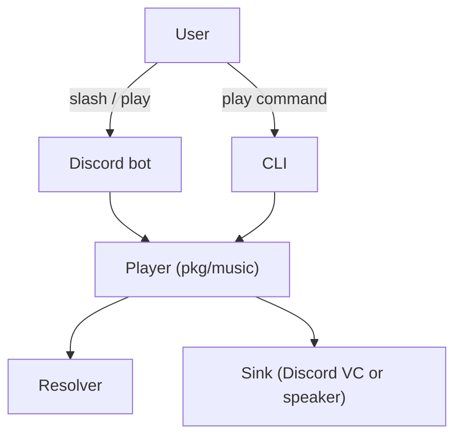

# Architecture

Melodix consists of two applications:

- Discord bot
- CLI player

Both use the same core package: `pkg/music`.

---

## High-level flow

- Discord bot receives slash command
- CLI receives user input
- Both call the same player logic

Core components:

- Player
- Resolver
- Stream
- Sink

---

## Playback pipeline

### 1. Resolve

Input:
- URL
- search query

Resolver detects source:
- YouTube
- SoundCloud
- radio

Returns track metadata and parser list.

---

### 2. Enqueue

Track is added to queue.

Queue is:
- per guild (Discord)
- per process (CLI)

---

### 3. PlayNext

Player:
- takes next track
- starts playback goroutine

---

### 4. Sink

Sink depends on mode:

- Discord: voice connection + Opus encoder
- CLI: speaker output

---

### 5. Stream

TrackStream:
- opens stream using parser

Parsers:
- yt-dlp
- kkdai
- ffmpeg

Output:
- PCM (48kHz stereo)

---

### 6. RecoveryStream

Wraps TrackStream.

Handles:
- early termination
- retry with same parser
- fallback to next parser

---

### 7. Playback

PCM is sent to sink until:
- stream ends
- stop is called

---

## Design decisions

### Shared core

Both CLI and Discord use identical playback logic.

This avoids:
- duplication
- inconsistent behavior

---

### Parser fallback

Each track has multiple parsers.

If one fails:
- next parser is tried

---

### Recovery over restart

Instead of restarting bot:
- stream is retried
- parser is switched

---

### Minimal abstractions

Core interfaces:

- AudioSink
- Stream
- Resolver

Everything else is concrete.

---

## When things fail

Typical failure cases:

- network interruption
- invalid stream
- parser failure

Handling:

- retry
- fallback parser
- restart stream

Bot restart is last resort.

## Flowchart
