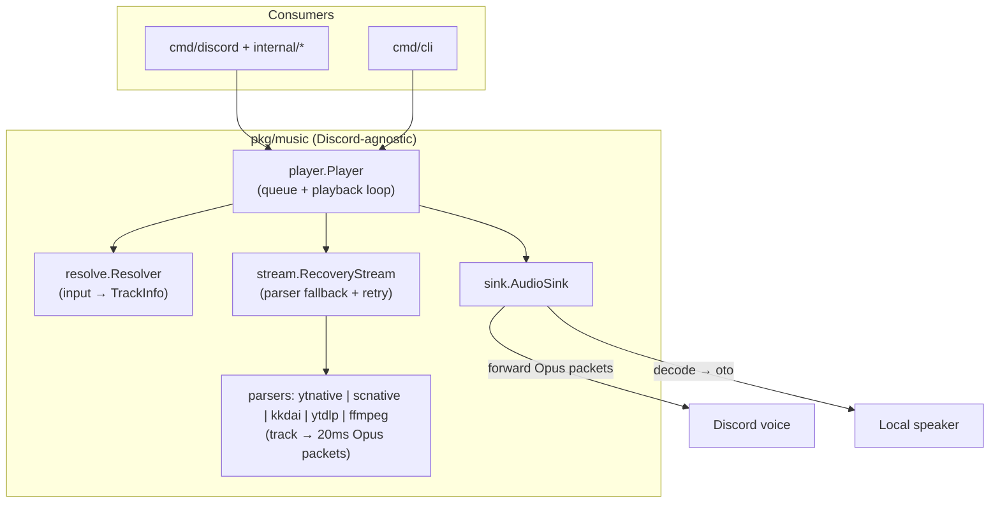
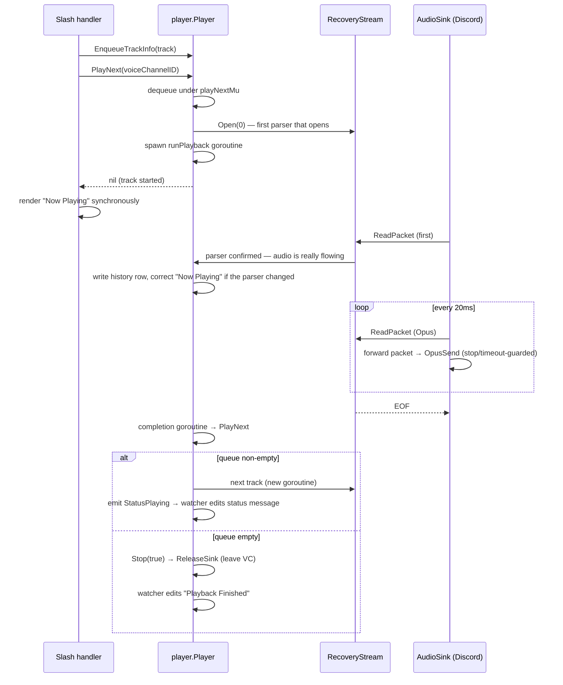

# Architecture

> House rules (naming, concurrency contracts, how to add sources/parsers) live
> in [conventions.md](conventions.md); this document covers how the system works.

Melodix is a Discord music bot built on top of a playback engine that doesn't
know Discord exists. The repo ships two binaries against that same engine:

- **`cmd/discord`** — the actual Discord bot: slash commands, voice, persistence,
  health watchdogs.
- **`cmd/cli`** — a small REPL that plays to your local speaker. It's a debugging
  tool, and also the proof that `pkg/music` really has no Discord dependency.


```mermaid
flowchart TB
  subgraph Consumers
    DiscordBot["cmd/discord + internal/*"]
    CLI["cmd/cli"]
  end
  subgraph Engine["pkg/music (Discord-agnostic)"]
    Resolver["resolve.Resolver<br/>(input → TrackInfo)"]
    Player["player.Player<br/>(queue + playback loop)"]
    Stream["stream.RecoveryStream<br/>(parser fallback + retry)"]
    Parsers["parsers: ytnative | scnative | kkdai | ytdlp | ffmpeg<br/>(track → 20ms Opus packets)"]
    SinkIface["sink.AudioSink"]
  end
  DiscordBot --> Player
  CLI --> Player
  Player --> Resolver
  Player --> Stream
  Stream --> Parsers
  Player --> SinkIface
  SinkIface -->|forward Opus packets| DiscordVC["Discord voice"]
  SinkIface -->|decode → oto| Speaker["Local speaker"]
```

---

## Package map

| Path | Responsibility |
|---|---|
| `pkg/music/player` | `Player`: FIFO queue, playback goroutine, transport recovery, status channel |
| `pkg/music/resolve` | `Resolver`: input → `[]TrackInfo`; source detection and precedence |
| `pkg/music/sources` | `Source` interface + `youtube`, `soundcloud`, `radio` implementations |
| `pkg/music/parsers` | `Streamer` interface + `ytnative`, `scnative`, `kkdai`, `ytdlp`, `ffmpeg` implementations |
| `pkg/music/opus` | The engine's currency: `Reader` (20ms Opus packets), a zero-dep WebM demuxer (passthrough), encode/decode adapters over `godeps/opus`, and a read-ahead `BufferedReader` (anti-skip); 48 kHz / stereo / 960-sample constants |
| `pkg/music/soundcloudapi` | Minimal SoundCloud api-v2 client (rotating client_id, resolve, stream URLs, search) shared by `scnative` and the soundcloud source |
| `pkg/music/stream` | Parser registry + `RecoveryStream` (packet-level recovery; optional cache-first read, write-through tee, and read-ahead buffer) |
| `pkg/music/cache` | Optional global, content-keyed track cache: tees played Opus packets to disk blobs and serves them on later plays (any guild); LRU size cap, persistent by default |
| `pkg/music/sink` | `AudioSink`/`Provider` interfaces + speaker implementation |
| `internal/discord` | The `Bot`: session lifecycle, handlers, health watchdogs, voice service |
| `internal/discord/voice` | Per-guild players and sink providers; guild status messages; **survives session restarts** |
| `internal/discord/voice/sink` | `DiscordSink`: forwards Opus packets to the voice connection (no encode) |
| `internal/discord/cmdadapter` | Bridges melodix command types to the `keshon/command` registry/middleware framework |
| `internal/discord/cmdsync` | Per-guild slash-command diff sync (create/edit/delete) |
| `internal/discord/reply` | Embed/response helpers shared by handlers and the voice service |
| `internal/discord/execguard` | Global command parallelism cap + per-command timeout |
| `internal/discord/watchdog` | Gateway-silence detection and WS/ready tracking |
| `internal/command` | Command implementations (`play`, `next`, `stop`, `history`, `help`, `settings`, …) |
| `internal/config` | Env-driven config (`caarlos0/env` + `.env`); all runtime knobs live here |
| `internal/storage` | Persistence: schema (guild settings, command log, playback rows, cache index) and the collections/indexes declared on the embedded datastore |

External process dependencies: **ffmpeg** is optional, used only by the
*transcode* parsers — SoundCloud AAC, radio, and the `kkdai-link`/`ytdlp-*`
fallbacks. YouTube itself plays back via Opus **passthrough**
(`ytnative-link` and `kkdai-pipe`), with no ffmpeg involved at all, so a
YouTube-first bot doesn't need either binary. **yt-dlp** is also optional —
it's the last resort in the `ytdlp-*` chain. Both paths default to `PATH` but
can be overridden (`ffmpeg.FFmpegPath` / `ytdlp.YtdlpPath`). `bwmarrin/discordgo`
is replaced with a vendored fork at `pkg/discordgo-fork-dev` (panic fixes,
stream handling).

---

## The three extension layers

Everything pluggable sits behind one of three small interfaces:

```go
// pkg/music/sources — URL/query → track metadata (no stream URLs yet)
type Source interface {
    Match(input string) bool
    Resolve(input string, selectedParser string) ([]TrackInfo, error)
    SourceName() string
    AvailableParsers() []string
}

// pkg/music/parsers — track → 20ms Opus packets (opus.Reader)
type Streamer interface {
    Open(track *Track, seekSec float64) (opus.Reader, func(), error)
}

// pkg/music/sink — Opus packets → audio output
type AudioSink interface {
    Stream(r opus.Reader, stop <-chan struct{}) error
}
type Provider interface {
    Sink(target string) (AudioSink, error)
    ReleaseSink(target string)   // player disconnected (leave VC)
    InvalidateSink()             // drop cached transport, next Sink() re-acquires
}
```

`TrackInfo` deliberately carries just a page URL, a title, the source name,
and an ordered parser preference list — nothing more. Actual stream URLs are
resolved lazily, by the parser, at open time, so a queued track never holds
an expiring CDN link.

---

## Resolution

`resolve.New()` registers the three sources. `Resolve(input, source, parser)`
tries these in order:

1. **An explicit source was selected** — validate the parser, then: a bare
   query is only allowed for the searchable sources (YouTube, SoundCloud); a
   URL has to pass `Match`.
2. **Auto-detect, bare query** — always routed to YouTube.
3. **Auto-detect, URL** — deterministic precedence: YouTube first, then
   SoundCloud. (Map iteration is deliberately never used for matching — a new
   source has to be added to this list by hand.)
4. **Fallback** — radio, which validates the URL by probing its Content-Type.

For search: YouTube scrapes its own results page with a regex. That's
fragile on purpose — when it breaks, only search breaks, and direct URLs
keep working regardless. SoundCloud search goes through api-v2's
`/search/tracks`, via the shared `soundcloudapi` client.

### YouTube: Opus passthrough (two paths) and the fallback chain

YouTube audio (itag 251) is *already* 48kHz stereo Opus inside a WebM
container — which happens to be Discord's exact wire format. So the goal
becomes simple: forward it untouched. `pkg/music/opus`'s zero-dep WebM
demuxer (`opus.Passthrough`) pulls the Opus packets out and hands them
straight to the sink, with no ffmpeg, no decode, and no re-encode anywhere in
between. It checks the first packet's framing (has to be a single 20ms
frame, since that's what Discord's sender expects) and falls back if that
check fails. The YouTube parser chain, in order:

- **`ytnative-link`** (passthrough) — POSTs to YouTube's InnerTube `player`
  endpoint using the VISIONOS client, gets back a direct cipher-free URL, and
  passes the stream through. It carries a `visitorData` session id,
  bootstrapped from the home page and refreshed from every player response;
  without one, InnerTube answers `LOGIN_REQUIRED` whichever client you use.
  The maintenance knobs are the client constants in
  `pkg/music/parsers/ytnative/innertube.go`, `clientVersion` first among them.
- **`kkdai-pipe`** (passthrough) — `kkdai/youtube` resolves a WebM/Opus stream
  and downloads it in chunks, which gets demuxed directly. It rides the same
  InnerTube client: kkdai's `DefaultClient` is pointed at VISIONOS in
  `pkg/music/parsers/kkdai/streamer.go`.
- **`kkdai-link`, `ytdlp-*`** (transcode) — the ffmpeg-encode fallbacks:
  ffmpeg decodes the source and `opus.Encode` re-encodes it into packets.
  These only get used once both passthrough paths are exhausted.

**Why the client choice matters.** googlevideo applies per-issuing-client
rules to the stream URLs it hands out. An `ANDROID_VR` URL answers 403 to
*any* open-ended request — a plain GET, or `Range: bytes=0-` — and serves
only bounded ranges of roughly 1 MiB. A `VISIONOS` URL serves all of those
shapes. Both of our readers ask open-ended (passthrough sends a plain GET,
ffmpeg sends `Range: bytes=0-`), so under `ANDROID_VR` every YouTube parser
died on its first read and the chain walked all the way down to yt-dlp.
Neither the User-Agent nor an `n` parameter is involved — both were measured
against the live CDN and ruled out. `TestLiveOpenEndedRequestAccepted` pins
the invariant, so a future regression points here instead of at those.

`ytnative` returns `ErrCipherOnly` on cipher-only responses; a passthrough
that fails framing validation returns `opus.ErrNotPassthrough`. Either way,
recovery just moves on to the next parser.

### SoundCloud (`scnative`)

`scnative` runs on `pkg/music/soundcloudapi`: the rotating `client_id` gets
scraped from the web player's JS bundles, cached, and refreshed automatically
whenever it hits a 401/403. Tracks resolve via `/resolve`, and whichever
transcoding is preferred (AAC HLS over HLS over progressive) gets transcoded
by ffmpeg and encoded to Opus packets — SoundCloud's AAC just isn't
passthrough-able. Radio streams go through the same ffmpeg transcode path.

A track's "Now Playing" chip shows `passthrough`, `ffmpeg`, or `cached`, so
you can tell at a glance which mode is actually active. The passthrough
packages also have opt-in live tests
(`MELODIX_LIVE_TESTS=1 go test -run Live -v ./...`) that act as canaries for
endpoint drift.

### Track cache & anti-skip buffer (optional, opt-in)

Two independent playback layers wrap the parser stream inside
`RecoveryStream`. Both are off by default and configured through env vars
(see `docs/running.md`):

- **Track cache** (`CACHE_ENABLED`). While a cacheable track plays,
  `RecoveryStream` copies every 20ms Opus packet into a disk blob keyed by
  content (`cache.Key`: `youtube:<id>` or `soundcloud:<url>`; radio can't be
  cached). This copy happens above the recovery logic, so a single blob
  spans parser switches and voice-transport reopens, and it only gets
  committed once the track plays through to a clean end — meaning a
  mid-track reconnect, which happens fairly often on flaky links, no longer
  throws the cache away. `RecoveryStream.Open` checks the cache before the
  parser list, so any later play of that track — same link, `/play <id>`, or
  even a different guild — serves straight from the blob: instant, no
  extraction, no ffmpeg. A miss or a bad blob just falls through to the
  normal parser chain, so the cache can never block playback. The index
  itself is a global, content-keyed collection in the datastore (a reserved
  key, LRU-evicted once `CACHE_MAX_BYTES` is hit), and the blobs are
  `sha256(key)`-named custom packet logs rather than playable media files.
  Persistent by default. One thing worth flagging: this stores copyrighted
  audio to disk. It's opt-in, and kept transient
  (`CACHE_PERSISTENT=false`) plus size-capped it behaves like a cache rather
  than an archive — but that's a real tradeoff to be aware of, not just a
  footnote.
- **Anti-skip buffer** (`BUFFER_AHEAD_MS`). `opus.BufferedReader` reads ahead
  into a bounded queue, so a short stall on the source drains from the
  buffer instead of stuttering audibly. It wraps the reader inside
  `RecoveryStream`, so the playback position (`seekSec`) still counts
  packets as they leave the buffer toward the sink — recovery reopens at the
  position actually played, never at the read-ahead position.

---

## Playback pipeline


```mermaid
sequenceDiagram
  participant H as Slash handler
  participant P as player.Player
  participant RS as RecoveryStream
  participant S as AudioSink (Discord)
  H->>P: EnqueueTrackInfo(track)
  H->>P: PlayNext(voiceChannelID)
  P->>P: dequeue under playNextMu
  P->>RS: Open(0) — first parser that opens
  P->>P: spawn runPlayback goroutine
  P-->>H: nil (track started)
  H->>H: render "Now Playing" synchronously
  S->>RS: ReadPacket (first)
  RS->>P: parser confirmed — audio is really flowing
  P->>P: write history row, correct "Now Playing" if the parser changed
  loop every 20ms
    S->>RS: ReadPacket (Opus)
    S->>S: forward packet → OpusSend (stop/timeout-guarded)
  end
  RS-->>S: EOF
  P->>P: completion goroutine → PlayNext
  alt queue non-empty
    P->>RS: next track (new goroutine)
    P->>P: emit StatusPlaying → watcher edits status message
  else queue empty
    P->>P: Stop(true) → ReleaseSink (leave VC)
    P->>P: watcher edits "Playback Finished"
  end
```

Key mechanics:

- **Queue** — a plain `[]Track` under `p.mu`. `playNextMu` serializes
  dequeue and open, so two tracks can never start at the same time.
- **Completion chain** — the flow runs `runPlayback → completion goroutine →
  PlayNext → startTrack → new runPlayback`. Iteration happens through fresh
  goroutines rather than recursion, and queue-end disconnect has exactly one
  decision point: `PlayNext` returning `ErrNoTracksInQueue` leads straight to
  `Stop(true)`.
- **Per-run ownership** — each run gets its own `stopPlayback`/`playbackDone`
  channels and its own track pointer, so a stale run's goroutine can never
  clobber a newer run's state (`clearIfCurrent` checks track identity before
  resetting anything).
- **Discord sink** — reads 20ms Opus packets and forwards them to `OpusSend`
  with no encoding step: a 10-packet warm-up primes the pipeline, then any
  leading near-silent packets (tiny under VBR) get skipped as dead air.
  Every `OpusSend` call is a `select` against the stop channel plus a send
  timeout, so `Stop()` always unblocks the streaming goroutine, and a
  stalled voice connection surfaces as `ErrVoiceTransport` rather than
  hanging silently.
- **Pause/Resume** — not supported, on purpose, since the sink owns the read
  loop. Commands that try get `ErrPauseNotSupported` back.

### Status delivery (single-consumer contract)

`Player.PlayerStatus` is a buffered channel meant to have exactly one
long-lived consumer per player. On the bot side that's
`voice.Service.watchPlayerStatus`, spawned once when the guild's player is
created; it only handles *asynchronous* transitions (auto-advance →
edit "Now Playing", natural queue end → "Playback Finished"). Anything
interaction-driven — "Now Playing" after `/play`, "Track(s) Added" — is
instead rendered synchronously by the handler, since it already knows what
`PlayNext` returned. Don't attach per-interaction listeners to the channel;
competing receivers will end up stealing events from each other.

The guild status UI is a single message per guild
(`voice.Service.UpdatePlaybackStatus`): created via interaction followup the
first time, edited from then on — which incidentally is also why updates
keep working past the 15-minute interaction-token expiry.

---

## Failure handling

There are three distinct failure classes here, each with its own mechanism:

1. **Media failures**, handled by `stream.RecoveryStream` on a per-track
   basis. Opening a parser proves nothing on its own — the ffmpeg-backed ones
   only spawn a process, so a CDN 403 surfaces on the first read — which is
   why `Open` logs `stream_opening` and the real `stream_opened` waits for the
   first packet. An instant fail — an error or EOF on that first read — moves
   on to the next parser in the track's preference list. An early EOF,
   meaning EOF before roughly 95% of the known duration, reopens the same
   parser at the current seek position, computed from bytes read, up to
   three attempts per parser. A natural EOF just passes through untouched.
2. **Voice transport failures**, handled in `player.runPlayback`, up to
   three attempts. An `ErrVoiceTransport` from the sink triggers either
   `hard` mode (invalidate the sink, forcing a voice-channel rejoin) or
   `soft` mode (retry the stream first — governed by
   `PLAYER_TRANSPORT_RECOVERY_MODE` and `PLAYER_TRANSPORT_SOFT_ATTEMPTS`),
   then reopens media at the current position without touching the media
   retry budget.
3. **Session failures**, handled in `internal/discord`. A gateway-silence
   watchdog (`WS_SILENCE_TIMEOUT`) plus a 30-second API probe with three
   strikes marks the session unhealthy, and `DISCORD_UNHEALTHY_MODE` decides
   what happens next (`restart-session`, `restart-voice`, or `ignore`).
   `main.go` runs `RunSession` in a restart loop, and since the voice
   service outlives individual sessions, queues and players survive
   reconnects — sinks just get invalidated and re-acquired.

On the user-facing side: synchronous failures get answered directly by the
handler, as an ephemeral embed. Asynchronous failures — a track dying
mid-play — travel through
`runPlayback → markPlaybackFailed → Options.OnPlaybackFailed → voice.Service.notifyPlaybackFailed`,
which edits the guild status message, falling back to a public message in
the last-used command channel if needed. `internal/playbackerr` turns the
raw error text into something a person can actually read.

`ProcessStream` (the ffmpeg wrapper) converts a zero-byte EOF from a failed
process into the real underlying error, so an instant ffmpeg failure — a
403, a bad URL — never gets mistaken for a clean track end. The transcode
parsers build ffmpeg via `ffmpeg.NewPCMCommand` (or `NewPCMCommandUA`, which
adds the extracting client's User-Agent) and wrap its
PCM output in `ffmpeg.OpusReader` (which encodes to Opus packets via `opus.Encode`); ffmpeg
stderr is captured and classified (403/forbidden/conversion failures at Warn).

---

## Discord command layer

Commands implement the melodix `Handler` interface and get registered
through `cmdadapter.Register` into `keshon/command`'s `DefaultRegistry`,
wrapped in middleware for guild-only checks, per-guild disabled-command
gating, permission checks, and invocation logging. Optional capabilities are
discovered through interface assertion: `SlashProvider`,
`ContextMenuProvider`, `ComponentInteractionHandler`.

Dispatch happens through `onInteractionCreate`, which routes slash and
context-menu commands through `execguard` (parallelism capped by
`COMMAND_PARALLELISM`, timed out by `COMMAND_TIMEOUT`); message components
are matched by a `customID` prefix convention (`name`, `name:`, `name_`).
Slash-command sync is handled by `cmdsync.Syncer`, which diffs desired
against existing per-guild commands by name, type, and fingerprint whenever
`INIT_SLASH_COMMANDS=true`. And `go run ./cmd/discord -readme` regenerates
the command listing in `README.md` straight from the registry — that's a dev
step, run from the repo root; the bot itself never writes files at runtime.

One thing to watch: the `source`/`parser` choice lists in `/play`'s slash
definition (`internal/command/music/play/play.go`) are maintained by hand,
and need to be kept in sync with the resolver and `stream.registryEntries`
manually.

---

## State & persistence

State lives in three places. In memory, per guild, and surviving reconnects:
`voice.Service` holds players, sink providers, status-message IDs, and
notify channels. In memory, per session: the `Bot`'s session context and
exec guard, swapped atomically on each `RunSession`. And on disk: an
embedded write-ahead-logged datastore (`keshon/datastore`) that owns the
entire `STORAGE_PATH` directory (`LOCK`, `wal.log`, `snapshot-*.json`).
Everything's held in memory, and every commit is appended and fsynced before
it's acknowledged. The collections are `guild_settings` (disabled command
groups), `command_log` (last 50 per guild), `playback` (last 750 per guild —
`/play <id>` replays an entry without re-resolving it), and `cache_entries`
(the global track-cache index). Per-guild collections are indexed by guild
ID and keyed `"<guildID>:<zero-padded id>"`, so reading an index returns a
guild's rows in chronological order; the IDs themselves come from the
store's persisted `tx.NextID` counters.

The storage directory is locked to a single process, so the CLI falls back
to an in-memory cache index if the bot already holds the lock, rather than
just refusing to start.

Only tracks that actually start playing get recorded, through the
`PlaybackRecorder` hook.

---

## Adding a new source or parser

To add a **source** (metadata only, reusing existing parsers):
1. New package under `pkg/music/sources/<name>/`, implementing `Source`.
2. Add the name constant to `pkg/music/sources/sources.go`.
3. Register it in `resolve.New()`, and add it to the auto-detect precedence
   list in `Resolver.Resolve` — this is deliberately explicit, not automatic.
4. If it's searchable by bare query, extend the query branch in the
   resolver.
5. Add it to `/play`'s `source` choices.

To add a **parser** (a new playback backend), implement `Streamer.Open`
returning an `opus.Reader`:
1. New package under `pkg/music/parsers/<name>/`. If the source is a native
   Opus container, use `opus.Demux` on the HTTP body for passthrough;
   otherwise build ffmpeg with `ffmpeg.NewPCMCommand` and wrap it in
   `ffmpeg.OpusReader`, which encodes PCM to Opus packets. A parser that
   supports both link and pipe modes carries a `Mode` field on its streamer.
2. Add the instance to `stream.registryEntries`
   (`pkg/music/stream/stream.go`), under its frozen key constant from
   `pkg/music/sources/parsers.go`.
3. List it in the owning source's `AvailableParsers()` and in `/play`'s
   `parser` choices.

That's it — the player, queue, recovery, sinks, and persistence are all
source- and parser-agnostic, so nothing else needs touching.

---

## Testing & verification

- `go test -race ./...` — the race detector isn't optional here. The player
  tests (`pkg/music/player/player_test.go`) include a concurrent hammer
  specifically to catch locking regressions. Fakes swap the registry via
  `stream.SetRegistry` (same pattern as `pkg/music/stream/recovery_test.go`)
  and stub the sink provider.
- `internal/discord/voice/sink/sink_discord_test.go` pins down the Opus-send
  contract: stop unblocks a stalled send, and a stalled or closed channel
  produces `ErrVoiceTransport`.
- Manual smoke checklist, which needs a real guild: a `/play` multi-track
  batch, checking the status message updates on every auto-advance; `/play`
  while already playing, which should give "Track(s) Added"; `/next`;
  `/stop` mid-track, which should return promptly; a natural queue end,
  which should give a single voice disconnect and "Playback Finished"; and
  one `/play` per parser override.
- `cmd/cli` exercises the whole engine minus Discord: `go run ./cmd/cli`,
  then `play <url>`, `next`, `stop`, `queue`, `status`.
