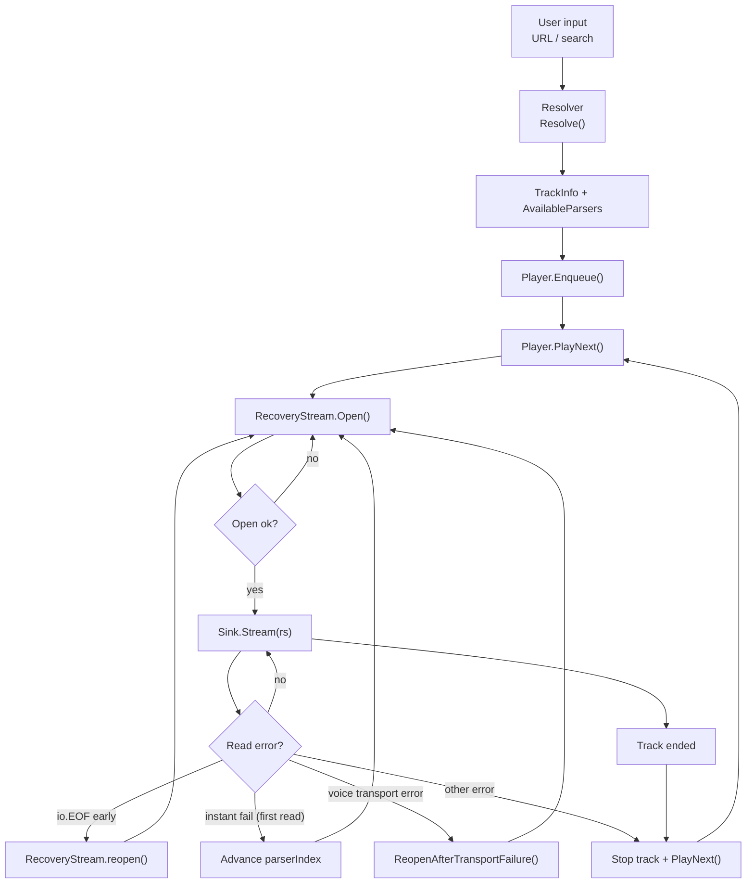

# music

Queue-based music playback library for Go with pluggable audio sinks and track resolvers. Resolves URLs and search queries (YouTube, SoundCloud, radio) and opens each track as a stream of 20ms Opus packets — YouTube plays by **Opus passthrough** (WebM demux, no ffmpeg, no transcode); other sources transcode through ffmpeg and encode to Opus. Plays through a sink of your choice (forward to Discord voice, or decode to a speaker).

## How it works (high level)

At runtime the system is a pipeline:

- **Resolve** user input → `sources.TrackInfo` (URL, title, available parsers)
- **Enqueue** resolved tracks into a FIFO queue
- **Open stream** using one of the available parsers (20ms Opus packets, 48kHz stereo)
- **Stream to sink** (speaker / Discord / custom) until the track ends or fails
- **Recover** when possible (parser fallback on instant-open failures; reopen on early EOF; special handling for voice transport)



## Install

```bash
go get github.com/keshon/melodix/pkg/music/...
```

## Quick start

Create a sink provider (e.g. speaker for local playback), a resolver, and a player; then enqueue and play:

```go
provider := sink.NewSpeakerProvider()
defer provider.Close()

res := resolve.New()
p := player.New(provider, res)

// Enqueue a URL or search query, then start playback
_ = p.Enqueue("https://www.youtube.com/watch?v=...", "", "")
_ = p.PlayNext("")  // "" for local; use voice channel ID for Discord
```

Listen to `p.PlayerStatus` for status updates (Playing, Added, Stopped, Error). See [examples/clispeaker](examples/clispeaker) for a full runnable CLI.

## Algorithms (by stage)

### 1) Resolve (input → TrackInfo)

Goal: convert user input into canonical metadata + a parser preference list.

- **Input**: URL or search query + optional `source`/`parser` hints.
- **Output**: `[]sources.TrackInfo` where `TrackInfo.AvailableParsers` is ordered by preference.

The resolver is intentionally pluggable; the player does not care *how* a track was discovered, only that it has a URL + parsers list.

### 2) Enqueue (TrackInfo → queue)

Goal: turn `TrackInfo` into `parsers.Track` and append to the FIFO queue.

- Tracks without `AvailableParsers` are rejected/skipped.
- `CurrentParser` starts as the first entry in `AvailableParsers` (will be updated later by recovery/open logic).

### 3) Start playback (dequeue → open resilient stream)

Performed by `Player.PlayNext()`:

- If something is playing, stop it.
- Pop the next track from the queue.
- Create `stream.RecoveryStream(track)` and call `rs.Open(seek=0)`.
- If open fails for all parsers, skip the track and try the next.

### 4) Open stream (choose parser)

Performed inside `RecoveryStream.Open(seek)`:

- Starting at `parserIndex`, iterate through `track.SourceInfo.AvailableParsers`.
- For each parser:
  - if `retries[parser] >= maxRecoveryAttempts` → skip
  - try `openWithParser(track, parser, seek)`
  - on success:
    - set `parserIndex` to that parser’s index
    - set `track.CurrentParser = parser`
    - reset `firstRead = true`
    - store cleanup + current seek

### 5) Media recovery (parser/ffmpeg level)

Recovery is intentionally conservative to avoid false-positive “fallback” when a track naturally ends.

**A) Instant failure right after open**

If the very first `Read()` on the opened stream returns any error (including an EOF-like failure from ffmpeg), it is treated as an *instant fail*:

- close/cleanup current stream
- `parserIndex++`
- open again at the current `seekSec` using the next parser

This is designed for cases like “ffmpeg opened, then immediately 403/forbidden and closed stdout”.

**B) Early EOF (mid-track)**

If `Read()` returns `io.EOF` with `n==0` and the track is far from its expected duration, recovery attempts to reopen:

- close/cleanup current stream
- reopen at the current approximate `seekSec`
- retries are bounded by `maxRecoveryAttempts` per parser

If duration is unknown, early-EOF recovery is only attempted at the beginning (`firstRead` or `seekSec < 1.0`).

### 6) Sink streaming + voice transport recovery

The sink drives the read loop via `AudioSink.Stream(reader, stopCh)`:

- On normal completion: the track ends → player advances to the next track.
- On `stream.ErrVoiceTransport` (Discord transport issues):
  - the player can invalidate/rejoin the sink (hard) or retry without rejoin (soft mode)
  - then calls `rs.ReopenAfterTransportFailure()` to reopen media at the current seek
- On user stop/skip: playback stops cleanly.

### Discord / UI: errors and `PlayerStatus`

`Player.PlayerStatus` is a buffered channel meant for a **single long-lived consumer** per player (competing receivers steal events). The Discord voice service runs one status watcher per guild player for async transitions (auto-advance to the next track, natural queue end); slash handlers render interaction-driven outcomes (“Now Playing” / “Track(s) Added”) synchronously since `PlayNext`/enqueue results are known in the handler. The player stores a capped `lastPlaybackUserErr` for consistent embed text.

When wired to Discord, the voice service passes `Options.OnPlaybackFailed` at player construction so a failure after “Now Playing” can **edit the guild status message** (same message id as “Now Playing”) instead of relying on an interaction follow-up that already finished.

The **ffmpeg**, **kkdai**, **ytnative** and **soundcloudapi** packages use package-level loggers: call their `SetLogger(appLogger)` once at process startup (the Discord bot does this in `NewBot`). All parsers build their ffmpeg invocation via `ffmpeg.NewPCMCommand`, which captures ffmpeg **stderr** for every parser: lines that look like HTTP 403 / forbidden / conversion failures are logged at **Warn**, other lines at **Debug** to limit noise. The binary paths default to `ffmpeg` / `yt-dlp` on `PATH` and can be overridden via `ffmpeg.FFmpegPath` / `ytdlp.YtdlpPath`.

**Manual regression checklist**

1. Broken or geo-blocked URL three `/play` commands in a row — no “wrong” error attributed to a later play; guild message shows failure when playback dies after start.
2. Enqueue while something is playing — queue / status messages stay consistent.
3. `/next` onto a broken next track — error text matches other failure paths (same length cap / phrasing family).

## Key extension points

- **Custom resolver**: implement `player.Resolver` to support new sources or search.
- **Custom sink**: implement `sink.AudioSink` / `sink.Provider` to support new outputs.
- **New parser**: implement `parsers.Streamer.Open` (returning an `opus.Reader`) and add it to `stream.registryEntries`.

## Requirements

- **ffmpeg** — Optional. Used by the transcode parsers (SoundCloud, radio, and the `kkdai-link`/`ytdlp-*` fallbacks) to decode audio; YouTube passthrough (`ytnative-link`, `kkdai-pipe`) needs no ffmpeg. Install it on `PATH` for full source coverage.
- **yt-dlp** — Optional. If installed, the ytdlp-link and ytdlp-pipe parsers are available; otherwise the library falls back to kkdai/ffmpeg parsers.
- **ebitengine/oto** — The speaker sink (`sink.NewSpeakerProvider()`) uses [oto](https://github.com/ebitengine/oto/v3) for audio output. Omit the speaker sink if you only need a custom sink (e.g. Discord).

## Documentation

- [player](player) — Queue-based playback engine
- [resolve](resolve) — Resolve URLs and search to track metadata
- [sink](sink) — Audio sink interfaces and speaker implementation
- [sources](sources) — Source interface and track types
- [parsers](parsers) — Streamer interface and track type
- [stream](stream) — Track stream opening and recovery

## License

music is licensed under the [MIT License](https://opensource.org/licenses/MIT).